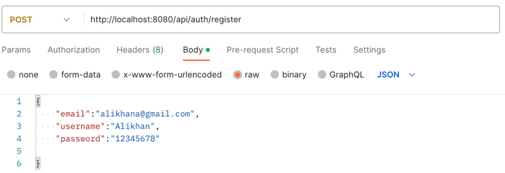

# STRONG TEAM backend test assignment

## Description 
This task is done by using java spring boot framework. 
You can run this project in docker by following commands:
-  ./mvnw clean package or mvn clean package (if maven is installed)
- docker build -t strong_backend_test_assignment.jar . 
- docker compose up -d

## Authentication
I used spring security to implement authentication part.
All get methods and requests related to authentication don't need Bearer token, other must include Bearer token in header. 
Here is register method and its request body: 

