# STRONG TEAM backend test assignment

## Description 
This task is done by using java spring boot framework. 
You can run this project in docker by following commands:
-  ./mvnw clean package or mvn clean package (if maven is installed)
- docker build -t strong_backend_test_assignment.jar . 
- docker compose up -d

## Authentication
I used spring security to implement authentication part.
All get methods and requests related to authentication don't need Bearer token, other must include Bearer token in header. 
Here is register method and its request body: 
 
That is response: 
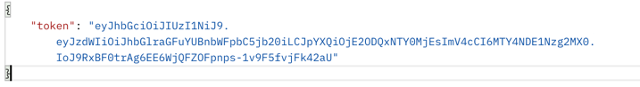  
Login(authenticate) request method and request body: 
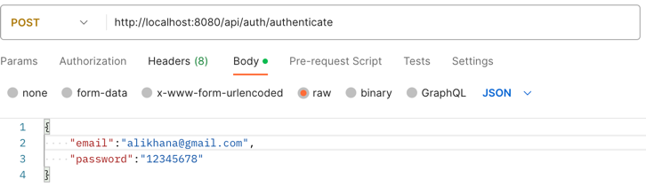 
Response: 
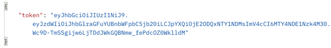"/>  

## GET, POST, PUT, DELETE methods for news topics
To post topic, you have to be authorized. Its endpoint and and request body: 
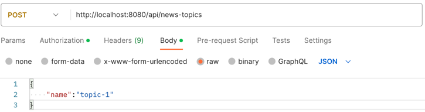 
Response: 
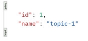  
Put request: 
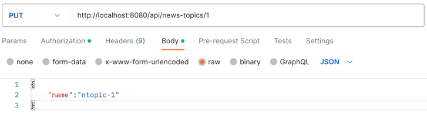 
Response: 
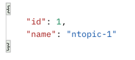  
Delete request: 
  
Get all topics(no token required): 
 
Example of response: 
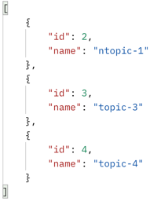  
Get exact topic: 
 
Response: 
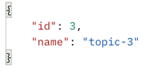  

## GET, POST, PUT, DELETE methods for news sources
All requests for sources are identical to topics(main:the same request body).But instead of 'news-topics' in endpoint, I chose to write 'news-sources'.

## GET, POST, PUT, DELETE methods for news
Post request for news. Its request body and response: 
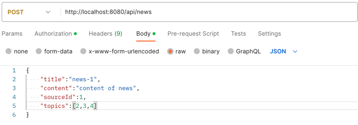 
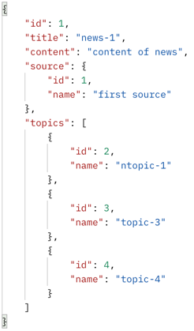  
Put request has the same request body and response, but another endpoint(at the end '/{id}'): 
  
Delete single news: 
  
Get single news: 
 
Response: 
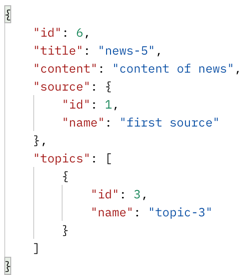  
## GET method for getting list of all news (with pagination)
I will provide only endpoint, because I couldn't make long screenshot: 
  
## GET method for getting list of news by source id (with pagination)
Endpoint: 
  
## GET method for getting list of news by topic id (with pagination)
Endpoint: 
  
## Scheduling task:
I wrote code in NewsSourceService.java, which creates every midnight csv file named 'source_news_statistics', which shows how much news each source holds. 
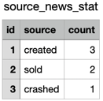  

